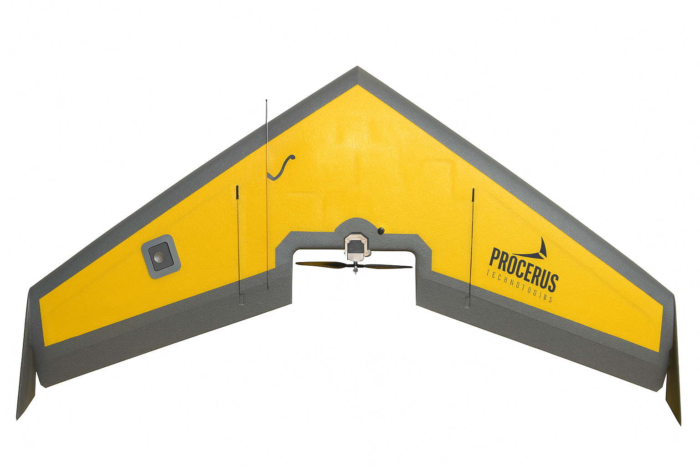

# Open Loop Dynamics of Zagi Flying Wing

## Introduction

-   **Zagi** is a radio-controlled (RC) flying wing glider introduced in
    1996 by Jerry Teisan in California.
-   Known in the RC community for:
    -   Simplicity
    -   Low cost
    -   High durability --- often referred to as "nearly indestructible"
-   **Construction:** Lightweight expanded polypropylene (EPP) foam
    covered with vinyl
-   **Flight Styles Supported:**
    -   Slope soaring (hill updraft)
    -   Thermal soaring (rising warm air)
    -   Electric-powered aerobatics
    -   Combat flying
-   **No tail surfaces:** Stability and control achieved through wing
    geometry and elevons

### Key Flying-Wing Advantages

-   High aerodynamic efficiency
-   Low drag due to no tail
-   Pitch stability from reflex airfoil
-   Compact and agile structure

> Variants include Zagi 400X, Zagi Fixx, Zagi THL -  all maintaining
> robust and efficient flying-wing principles.

## Airframe Breakdown

### 1. Wing Platform

-   Type: Swept flying wing (no fuselage or tail)
-   Span: Approximately 1.2 m (varies by model)
-   Planform: Tapered wing with moderate sweep
-   Material: EPP foam, laminated
-   Reinforcement: Carbon or fiberglass spar
-   Purpose:
    -   Enhances natural yaw and pitch stability
    -   Provides efficient lift distribution

### 2. Airfoil

-   Reflex or semi-reflex airfoil
-   Upward curvature near trailing edge creates positive pitching moment
-   Compensates for lack of tail
-   Examples: Zagi-specific foils, MH-series, Eppler reflex profiles
-   Allows trimmed hands-off stable flight

### 3. Control Surfaces (Elevons)

-   Two elevons on the trailing edge
-   Combined function of elevator and aileron
-   Symmetric movement provides pitch control
-   Differential movement provides roll control
-   No rudder - yaw stability through wing sweep and differential drag

### 4. Propulsion (Electric Versions)

-   Pusher motor mounted behind center section
-   Propeller behind trailing edge for improved aerodynamics
-   Battery placed in central fuselage pod

### 5. Stability and Aerodynamics

| Features | Purpose |
|:-----: | :----:|
|Reflex airfoil | Pitch stability (Positive Cm)  |
|Wing Sweep | Directional stability & yaw damping |
|Wing twist or wash out | Improve yaw stability and reduce induced drag |

>Because it's tailless, the zagi requires careful CG placement. Too far back --> unstable pitch oscillations; too forward --> sluggish response
    
## Simualtion of Zagi Flying Wing

>The physical parameters, aerodynamic coefficients and propulsive (Thrust and Motor) coefficients are extracted from "Small Unmanned Aircraft: Theory and Practice" - Randal W Beard and Timothy W McLain

| Parameter | Value | Category |
|-----------|-------|----------|
| mass (m) | 1.56 kg | Inertial |
| Ixx | 0.1147 kg-$m^2$ | Inertial |
| Iyy | 0.0576 kg-$m^2$ | Inertial |
| Izz | 0.1712 kg-$m^2$ | Inertial |
| Ixz | 0.0015 kg-$m^2$ | Inertial |
| Wing Area (S) | 0.2589 $m^2$ | Geometric |
| Wing span (b) | 1.4224 m | Geometric |
| Mean aerodynamic chord (c) | 0.3302 m | Geometric |
| $S_{prop}$ | 0.0314 | Geometric |
| $Density (\rho)$ | 1.2682 kg-m³ | Environmental |
| $k_{motor}$ | 20 | Propulsion |
| $k_{T_p}$ | 0 | Propulsion |
| $k_Ω$ | 0 | Propulsion |
| Oswald efficiency factor (e) | 0.9 | Aerodynamic |
| $C_{L_0}$ | 0.09167 | Longitudinal |
| $C_{D_0}$ | 0.01631 | Longitudinal |
| $C_{m_0}$ | -0.02338 | Longitudinal |
| $C_{L_\alpha}$ | 3.5016 | Longitudinal |
| $C_{D_\alpha}$ | 0.2108 | Longitudinal |
| $C_{m_\alpha}$ | -0.5675 | Longitudinal |
| $C_{L_q}$ | 2.8932 | Longitudinal |
| $C_{D_q}$ | 0 | Longitudinal |
| $C_{m_q}$ | -1.3990 | Longitudinal |
| $C_{L_{\delta_e}}$ | 0.2724 | Longitudinal |
| $C_{D_{\delta_e}}$ | 0.3045 | Longitudinal |
| $C_{m_{\delta_e}}$ | -0.3245 | Longitudinal |
| $C_{prop}$ | 1.0 | Longitudinal |
| M | 50 | Longitudinal |
| $α_0$ | 0.4712 | Longitudinal |
| $\epsilon$ | 0.1592 | Longitudinal |
| $C_{D_p}$ | 0.0254 | Longitudinal |
| $C_{Y_0}$ | 0 | Lateral |
| $C_{l_0}$ | 0 | Lateral |
| $C_{n_0}$ | 0 | Lateral |
| $C_{Y_\beta}$ | -0.07359 | Lateral |
| $C_{l_\beta}$ | -0.02854 | Lateral |
| $C_{n_\beta}$ | -0.00040 | Lateral |
| $C_{Y_p}$ | 0 | Lateral |
| $C_{l_p}$ | -0.3209 | Lateral |
| $C_{n_p}$ | -0.01297 | Lateral |
| $C_{Y_r}$ | 0 | Lateral |
| $C_{l_r}$ | 0.03066 | Lateral |
| $C_{n_r}$ | -0.00434 | Lateral |
| $C_{Y_{\delta_a}}$ | 0 | Lateral |
| $C_{l_{\delta_a}}$ | -0.1682 | Lateral |
| $C_{n_{\delta_a}}$ | -0.00328 | Lateral |

### Aerodynamic Coefficients

- Lift Coefficient
    
    $C_L = [(1-\sigma(x))[C_{L_0}+C_{L_\alpha}\alpha] + \sigma(x)[2\alpha\sin^2 (\alpha )cos(\alpha)]] + C_{L_q}\frac{c}{2V_a}q + C_{L_{\delta_e}}\delta_e$

    $\sigma(x) = \frac{1 + e^{-M(\alpha - \alpha_0)} + e^{M(\alpha+\alpha_0)}}{(1 + e^{-M(\alpha - \alpha_0)}) (1 + e^{M(\alpha+\alpha_0)})}$

- Drag Coefficient

    $C_D = C_{D_0} + C_{D_p} + C_{D_\alpha}\alpha + \frac{{C_L}^2}{\pi eAR} + C_{D_q}\frac{c}{2V_a}q + C_{D_{\delta_e}}\delta_e$

- Pitching Moment Coefficient

    $C_m = C_{m_0} + C_{m_\alpha}\alpha + C_{m_{\delta_e}}\delta_e + C_{m_q}\frac{c}{2V_a}q$

- Side Force Coefficient

    $C_Y = C_{Y_0} + C_{Y_\beta}\beta + C_{Y_p}\frac{b}{2V_a}p + C_{Y_r}\frac{b}{2V_a}r + C_{Y_{\delta_a}}\delta_a $

- Rolling Moment Coefficient

    $C_l = C_{l_0} + C_{l_\beta}\beta + C_{l_p}\frac{b}{2V_a}p + C_{l_r}\frac{b}{2V_a}r + C_{l_{\delta_a}}\delta_a $

- Yawing Moment Coefficient

    $C_n = C_{n_0} + C_{n_\beta}\beta + C_{n_p}\frac{b}{2V_a}p + C_{n_r}\frac{b}{2V_a}r + C_{n_{\delta_a}}\delta_a $
